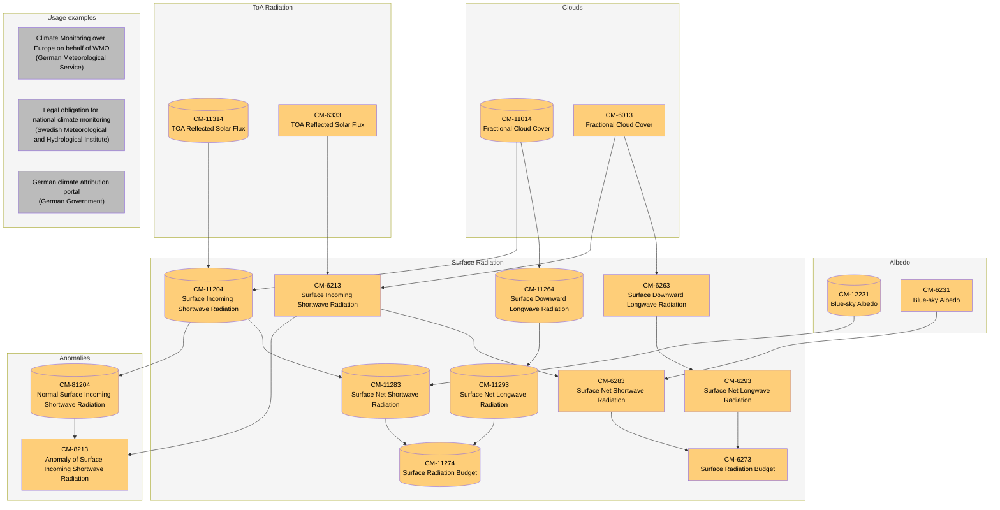
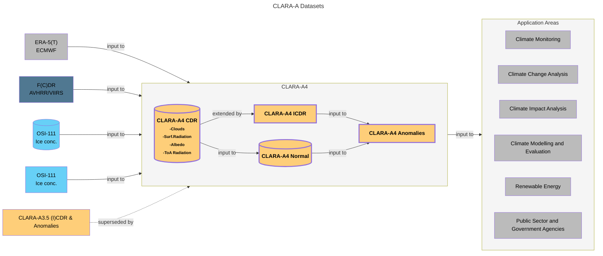
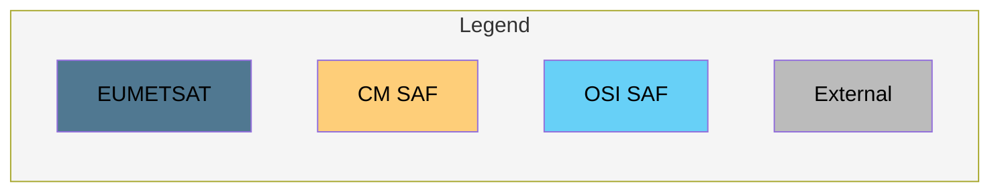
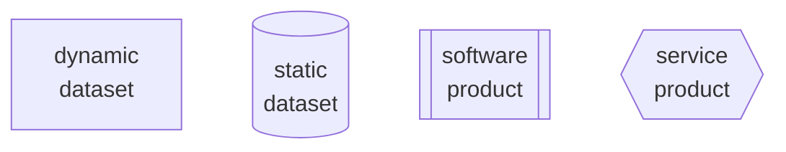
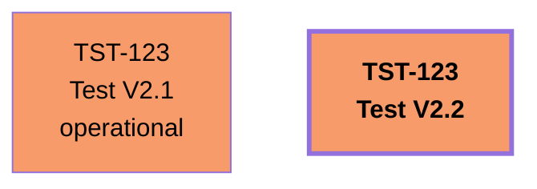
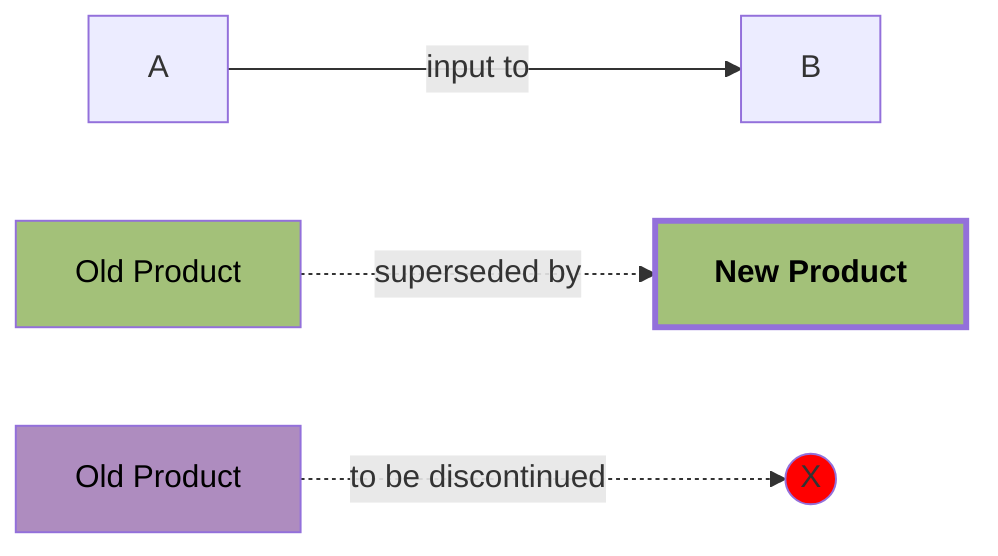

# dependency-graph

Python script for auto-generating product dependency graphs using Mermaid.

## Usage

1. Export product Excel sheet to CSV
2. Generate mermaid code
   ```
   python mermaid.py myfile.csv
   ```
3. Copy and paste output into the [Mermaid Online Editor ](https://mermaid.live)

## Examples

To view the Mermaid code, click [here](https://github.com/cmsaf/dependency-graph/blob/main/README.md?plain=1).


### Dependency Graph (auto-generated)

Here's a diagram generated from the `clara.csv` file in this repo. Note that there are no
connections to usage examples. This is not supported by the simple data model in the
Excel sheet, so we'll add them manually. We will also tweak the layout a bit by allowing
Mermaid to make certain arrows longer (by default it tries to minimize arrow length).



### Overview (created manually)





## General Diagram Guidelines

For reference, these are the general diagram guidelines.

* Products are represented by elements ("nodes") identified by their Product Identifier
* The first text element is the Product identifier as the only mandatory element,
  followed by the product name in the second row. Further specification can be provided
  in the following rows as necessary.

### Product categories

Different product types are characterised through their shape



Newly proposed product commitments should use bold text and thicker box outlines



### Connectors

Relation and dependencies between products can be assigned via connectors and arrows.

- **Solid arrow**: "input to"
- **Dashed arrow**: "superseded by"
- **Dashed arrow**: "to be discontinued"


