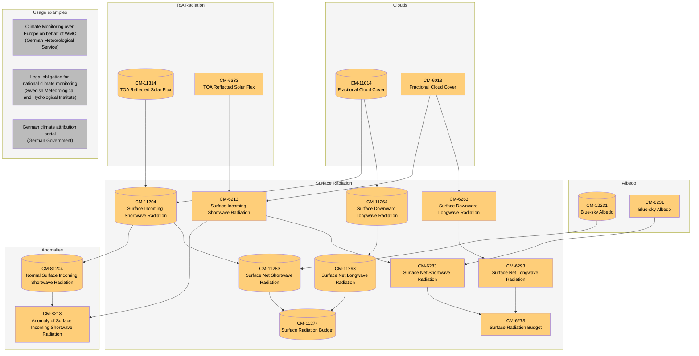

# dependency-graph

Python script for auto-generating product dependency graphs using Mermaid.

## Usage

1. Export product Excel sheet to CSV
2. Generate mermaid code
   ```
   python mermaid.py myfile.csv
   ```
3. Copy and paste output into the [Mermaid Online Editor ](https://mermaid.live)

## Example

Here's a diagram generated from the `clara.csv` file in this repo.

Note that there are no connections to usage examples. This is not supported by the
simple data model in the Excel sheet. We'll add them manually.


